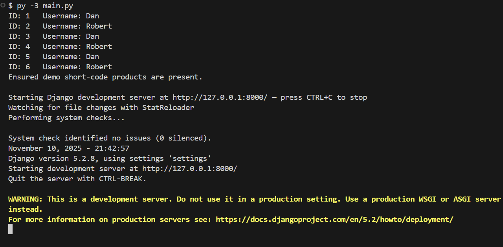
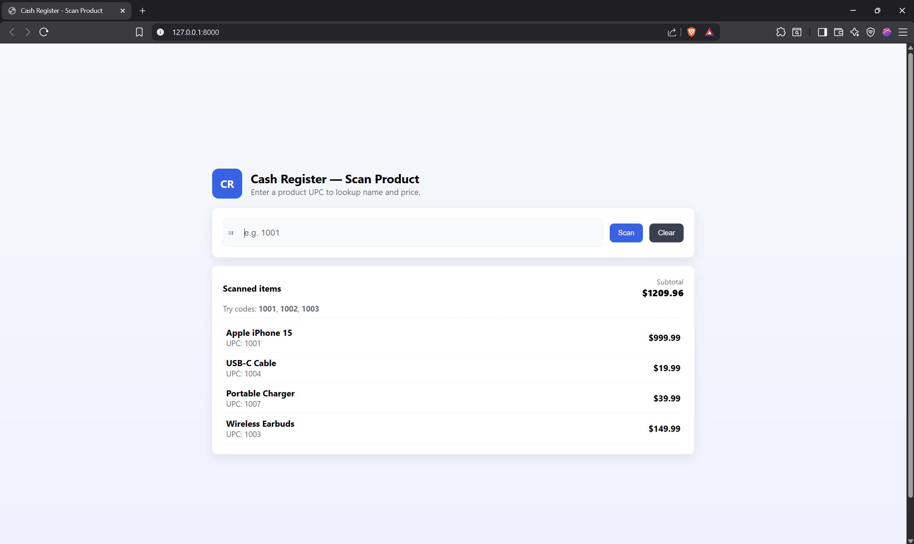

# Assignment 3 – Django and Energy (Group 26 · CRN 45894)

- Welcome to our Assignment 3 workspace for Django and Energy Efficiency. This repo pairs a hands-on Django cash register demo—built around the ORM and easy-to-run scripts—with an architectural write-up focused on energy-efficient mobile systems. Everything is written in our own words so reviewers can understand what we built, why we made our design choices, and how to run the demo in just a few steps.


## What’s in this project?

- **Cash Register Demo (Django ORM):** A lightweight product lookup UI that lets me scan short UPC codes (`1001`…`1010`), append scanned items to a list, and watch the subtotal update instantly.
- **Seeding & Convenience Runner:** `main.py` seeds demo products and launches the dev server in one command so the reviewer doesn’t need to remember multiple steps.
- **Energy Efficiency Scenario:** Our group’s quality attribute scenario for a mobile health-tracking app, with tactics mapped to *Software Architecture in Practice* and the Design Concepts Catalog.

Stack: Python 3.13, Django 5.x, SQLite.


## Quick Start

```powershell
# optional: create and activate a virtual environment
py -3 -m venv .venv
.\.venv\Scripts\activate

# install dependencies once
pip install django

# seed demo products and start the dev server
py -3 main.py
```

Alternatively, if you prefer the step-by-step layout from the assignment handout:

Create a folder for your project on your local machine  
```
mkdir assignment3
cd assignment3
```

Create a virtual environment and install Django  
```
py -3 -m venv .venv
.\.venv\Scripts\activate
pip install django
```

Download this assignment repository from GitHub  
```
git clone https://github.com/OTUSOFE365025/assignment-3-django-and-energy-group-26-crn-45894.git
cd assignment-3-django-and-energy-group-26-crn-45894
```

Initialize the database  
```
py -3 manage.py migrate
py -3 manage.py seed_products
```

Run the project  
```
py -3 main.py
```



Open `http://127.0.0.1:8000/` in a browser. Enter any demo code (for example `1001`) and click **Scan** as many times as you like. Each scan appends to the list and updates the subtotal automatically. Stop the server with `CTRL+C`.



Prefer standard Django commands?

```powershell
py -3 manage.py migrate
py -3 manage.py seed_products
py -3 manage.py runserver
```


## Repo map 

| Path | Why it matters |
| --- | --- |
| `settings.py` | Django configuration + SQLite database setup. |
| `manage.py` | Standard Django management entry point. |
| `main.py` | My convenience runner that seeds demo data and launches the dev server. |
| `db/models.py` | Defines the `Product` model (UPC, name, price) plus a toy `User`. |
| `db/views.py` | Contains the HTML view and JSON endpoint used by the scanning UI. |
| `db/templates/db/product_lookup.html` | The single-page UI for entering UPCs and showing the subtotal. |
| `db/management/commands/seed_products.py` | Populates the database with easy-to-type demo products. |
| `db/migrations/` | Schema history so `migrate` works predictably for graders. |

Navigation tips:
- ORM usage is easiest to see in `db/models.py` and the queries inside `db/views.py`.
- The JavaScript that handles scanning and subtotal updates lives inline in the template (look for the `<script>` block near the bottom of `product_lookup.html`).


## Part 1 – Cash Register System

**Description:**  
Designed and analyzed the architecture for a **Cash Register System** using the provided requirements document.  
The goal was to identify the appropriate **reference architecture** and outline how it meets the system’s needs.

**Key Decisions:**  
- Selected **Rich Client Application Architecture** as the most suitable choice.  
- This architecture allows the system to:  
  - Operate **offline or intermittently connected**, ensuring continued functionality without constant internet access.  
  - Provide a **fast, responsive interface** for immediate transactions.  
  - Interact directly with **local hardware** (printers, scanners, card readers).  
  - Synchronize with back-office servers when a connection is available.  
- The design leverages local data storage for reliability and performance while supporting synchronization for sales uploads and catalog updates.

**Outcome:**  
A well-structured rich-client model that balances **availability**, **performance**, and **maintainability**, aligning with retail point-of-sale requirements.


## Part 2 – Energy Efficiency (Quality Attribute Scenario)

**Description:**  
Defined a concrete **Energy Efficiency Quality Attribute Scenario** and identified relevant **architectural tactics** for a **mobile health-tracking application**.  
The analysis followed the *Energy Efficiency General Scenario* format and was submitted to Canvas as a PDF.

**Deliverables:**  
- Completed **Energy Efficiency Quality Attribute Table** (Source, Stimulus, Artifacts, Environment, Response, Response Measures).  
- Explained four key **tactics**:  
  1. **Adaptive Sampling / Duty Cycling**  
  2. **Batching and Deferred Execution**  
  3. **Energy-Aware Networking**  
  4. **Energy-Efficient UI Rendering**  
- Linked tactics to design concepts from *Software Architecture in Practice* and the *Design Concepts Catalog*.  
- Submitted the formatted document as a **PDF on Canvas**.


## Contributors
**Pranav Ashok** – Part 1 : Cash Register System  
**Ivan Arudpiragasam** – Part 2 : Energy Efficiency  
**Ahmad Amaree** – Documentation & Review


## License

Released under the MIT License.


